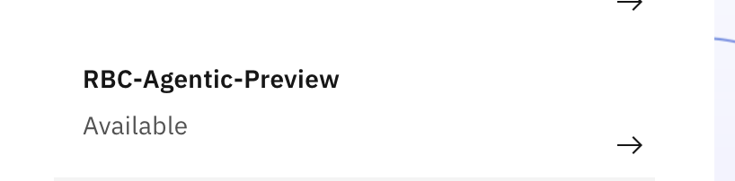
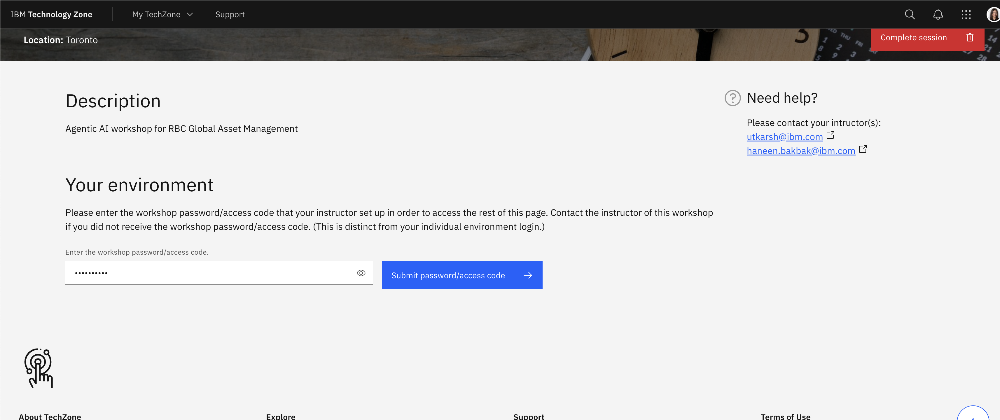

# Access Class Environment

**Note:** Follow these instructions for accessing your instance of the class environment in order to successfully complete the Agentic AI workshop. 

## watsonx Orchestrate Environment
Environment Details
1. IBM watsonx Orchestrate URL: https://dl.watson-orchestrate.ibm.com/

2. Credentials: your IBM-id. If you still need to create an IBM Cloud id, please follow these [steps](./create-IBMid.md).

3. Select the RBC-Agentic-Preview account. **If you do not see this, inform your lab instructors**

## watsonx.ai Environment
### Open a NEW INCOGNITO WINDOW. Do not close the watsonx Orchestrate environment window (from above steps)

1. Navigate to https://ibm.biz/Bdnp3r.

2. Login with your IBM Cloud id. If you still need to create an IBM Cloud id, please follow these [steps](./create-IBMid.mdd).

3. Enter the workshop password (provided by the lab instructor).

4. Open up the IBM Cloud Login (format: cloud.ibm.com/authorize/itzwatsonXXX) in an **INCOGNITO WINDOW**.  
Enter the username and password that is assigned to you.
   

## Navigate to watsonx.ai 
5. In the same incognito window, open a new incognito tab and navigate to https://dataplatform.cloud.ibm.com/wx/home?context=wx

6. Now you have your watsonx.ai environment open! Keep this in an incognito tab as you go about the lab. 
 

