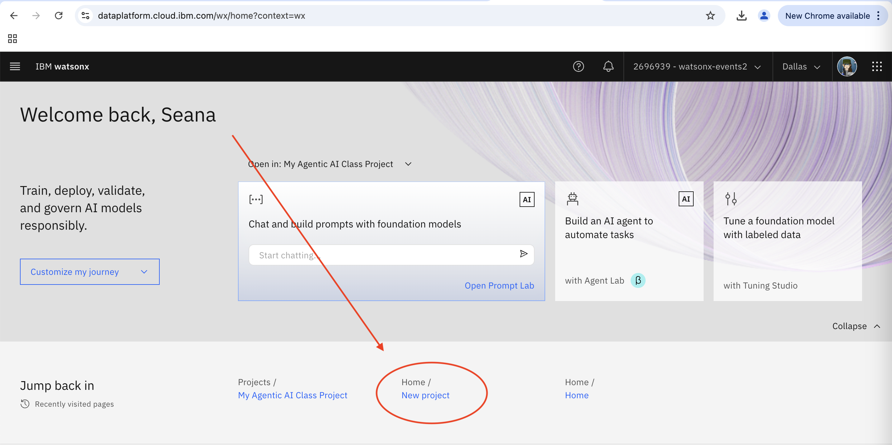
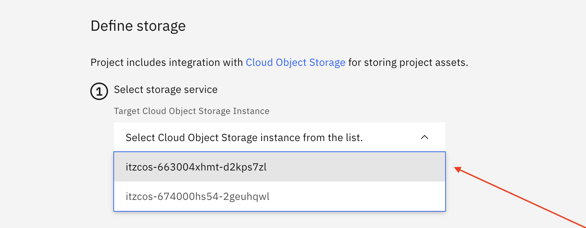
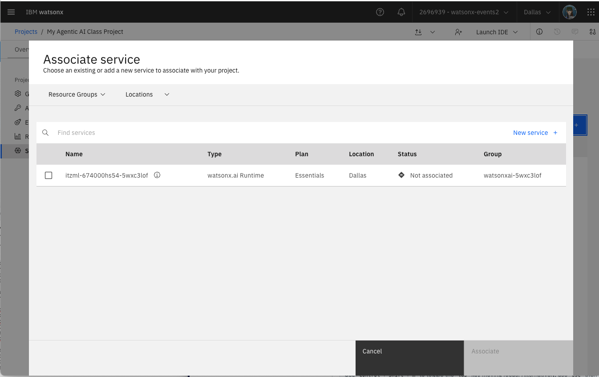

# Project Setup - New Project
---
## Summary
Before starting the first technical lab, we will be walking through how to create your own project to get familiar with watsonx.ai and ensure you have access to your environment for the workshop. 

It is important we create a project in the right environment, or else it will cause issues down the line!

## Table of Contents

  1. [Log into watsonx](#log-in-to-watsonx)
  2. [Create a new project](#new-project) 
  3. [Associate the correct runtime instance](#runtime-instance)

### 1. Log into watsonx
---
Follow these steps to open up your [watsonx.ai environment](/environment-setup/access-env.md#watsonxai-environment)  (this should be in an incognito tab). The watsonx.ai environment should be opened on the following link https://dataplatform.cloud.ibm.com/wx/home?context=wx. 

### 2. Create a new project
---
Now, we can go ahead and create a new project. 

In the **Projects** section, click the "+" symbol to create a new project.
 
Or, use the link here to trigger a [New Project](https://dataplatform.cloud.ibm.com/projects/new-project?context=wx) creation.

Enter a **unique name** for your project, include both your first and last name and any other information you would like.

### Cloud Object Storage (COS)
It is likely there is also already a Cloud Object Storage instance selected for you, with a name that starts with "itzcos-..." If so, you don't have to do anything! 

Otherwise, you may be prompted to select from multiple instances. Please consult with your workshop lead which COS instance to select.

### Click Create
Now, click Create. It may take a few seconds to officially be created.

### 3. Associate the correct runtime instance
---
With the project created, you should be directed to the project home page. Select the "Manage" tab.

Click on "Services and Integrations" in the left sidebar. Then, click on "Associate service."

Select the service listed with "Type" = "watsonx.ai Runtime" and click **Associate**. 

Time to get started with your first use case!
